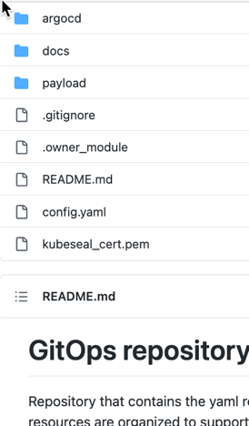

# gitops-create-guestbook-application

The objective is to show how to deploy a guestbook application to an existing bootstrap configuration of Argo CD from Software Everywhere.

## Pre-requisites

Please follow the [Lab 3 of Software Everywhere Operate Getting started](https://operate.cloudnativetoolkit.dev/getting-started/lab3/) to setup an OpenShift Cluster preconfigure with Argo CD and a `Software Everywhere` bootstrap configuration for Argo CD.

## Bootstrap configuration

The bootstrap configuration that was created from the [terraform-tools-gitops](https://github.com/cloud-native-toolkit/terraform-tools-gitops) module and has following structure in Argo CD. That structure is also refected in the related github project.


The diagram is provided by the terraform-tools-gitops]

## Create a new application

To create a new application we will save a new `Argo CD application configuration` in the `3-Application` folder in your created bootstrap repository.

* Configuration in Argo CD


* Files and folders in the used github repository




## Create a new Argo CD configuration

### Step 1: Create a needed folder in the `3-Application` folder

Create following folderstructer `cluster/default` in the github repository which is used as the Argo CD repository to configure the bootstrap configuration.
This structure is expected pre-configuration for the gitops bootstrap.


### Step 2: Create a new Argo CD application configuration that will deploy the guestbook application

1. Create a new file called `guestbook.yaml` in the folder `cluster/default`
2. Copy and past following content in the newly created file

Here some information about the appication configuration:

* We will deploy the guestbook application to our cluster `server: https://kubernetes.default.svc`
* We will use the helm-guestbook example from Argo CD https://github.com/argoproj/argocd-example-apps
* We will reference to the `3-applications` project

```sh
apiVersion: argoproj.io/v1alpha1
kind: Application
metadata:
  name: guestbook
  namespace: openshift-gitops
  finalizers:
    - resources-finalizer.argocd.argoproj.io
spec:
  destination:
    namespace: openshift-gitops
    server: https://kubernetes.default.svc
  project: 3-application
  source:
    helm:
      parameters:
        - name: replicaCount
          value: "2"
      valueFiles:
      - values.yaml
    repoURL: https://github.com/argoproj/argocd-example-apps
    path: helm-guestbook
    targetRevision: master
  syncPolicy:
    automated:
      prune: true
      selfHeal: true
    syncOptions:
    - CreateNamespace=true
```

### Step 3: Verify the Application configuration

In Argo CD we will notice that the application configuration will be deployed, but the guestbook application can't be deployed.

1. The image below shows the deployed Argo CD configuration for the guestbook application.

[](images/gitops-argocd-config-08.png)

2. Here we see configuration app-of-apps configuration starting from the 3-Application configuration in Argo CD.

[](images/gitops-argocd-config-07.png)

3. When we click on the guestbook application, we the that the related Argo CD `3-Application` does not allow to access the repository.

[](images/gitops-argocd-config-06.png)

### Step 4: Update the Application configuration

Now we will change the related project configuration to default, which does allow also to access other repositories. This is the value we change: `spec.project: 3-applications` to `spec.project: default` and save the updated file.

Or just copy the code to your `guestbook.yaml`.

```sh
apiVersion: argoproj.io/v1alpha1
kind: Application
metadata:
  name: guestbook
  namespace: openshift-gitops
  finalizers:
    - resources-finalizer.argocd.argoproj.io
spec:
  destination:
    namespace: openshift-gitops
    server: https://kubernetes.default.svc
  project: default
  source:
    helm:
      parameters:
        - name: replicaCount
          value: "2"
      valueFiles:
      - values.yaml
    repoURL: https://github.com/argoproj/argocd-example-apps
    path: helm-guestbook
    targetRevision: master
  syncPolicy:
    automated:
      prune: true
      selfHeal: true
    syncOptions:
    - CreateNamespace=true
```

### Step 5: Verify the updated application

Now you can see the application will be deployed.

* The guestbook application


[](images/gitops-argocd-config-09.png)

* The guestbook application detail


[](images/gitops-argocd-config-10.png)

### Step 6 (Optional) : Add an additional Argo CD 

```yaml
apiVersion: argoproj.io/v1alpha1
kind: Application
metadata:
  name: helloworld
  namespace: openshift-gitops
  finalizers:
    - resources-finalizer.argocd.argoproj.io
spec:
  destination:
    namespace: openshift-gitops
    server: https://kubernetes.default.svc
  project: default
  source:
    helm:
      parameters:
        - name: replicaCount
          value: "2"
      valueFiles:
      - values.yaml
    repoURL: https://github.com/open-toolchain/hello-helm
    path: chart/hello
    targetRevision: master
  syncPolicy:
    automated:
      prune: true
      selfHeal: true
    syncOptions:
    - CreateNamespace=true
```