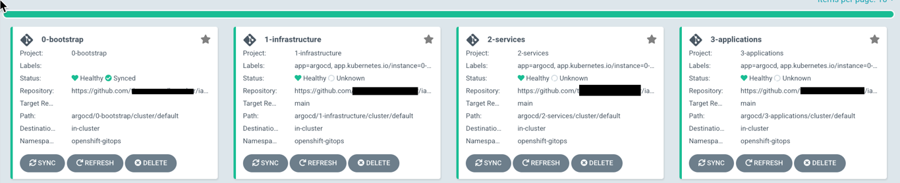

# gitops-create-hello-world-application

The objective is to show how to deploy a hello world application to an existing customer using the bootstrap configuration of Argo CD from Software Everywhere.

## Pre-requisites

Follow [lab 3 of Software Everywhere](https://operate.cloudnativetoolkit.dev/getting-started/lab3/) to setup a OpenShift Cluster preconfigure with Argo CD and a `Software Everywhere` bootstrap configuration.

## Bootstrap configuration

The bootstrap configuration that was created from the [terraform-tools-gitops](https://github.com/cloud-native-toolkit/terraform-tools-gitops) module and has following structure in Argo CD. That structure is also refected in the related github project.

The diagram is provided by the terraform-tools-gitops]

## Create a new application

To create a new application we will save a new `Argo CD application configuration` in the `2-Application` folder in your created bootstrap repository.

* Configuration in Argo CD

* Files and folders in the used github repository

## Create a new Argo CD configuration

### Step 1: Create a needed folder in the `3-Application` folder

Create the `cluster/default` is github repository which is used as the Argo CD repository to configure the bootstrap configuration.

